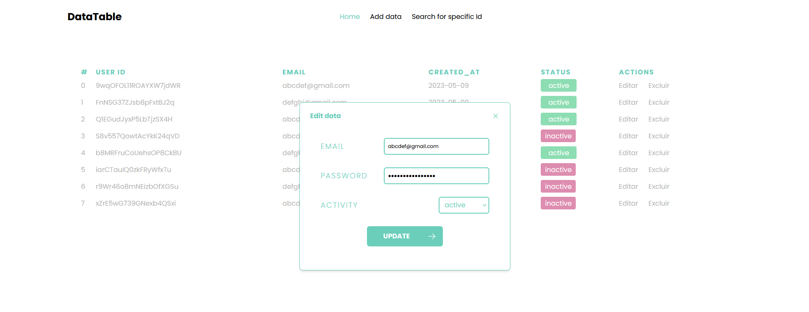

# Next12 data table

This is a project built with Next.js 12. I created it to gain experience with Next.js, since I had previously built a <a href="https://github.com/Arkadina/reactjs-CRUD-v1">similar project</a> with React.js. While there are some bugs I may or may not address in the future, such as rendering alerts twice, slow data retrieval, and poor code structure, I am still learning and improving. This project also allowed me to revisit some libraries that I have used in the past, including Tailwind CSS and Firebase, among others.



## Libraries

heroicons, firebase, luxon, framer-motion, sass & tailwindcss.

## Start server

Set your firebase config at ./config/firebase.js

```js
const firebaseConfig = {
    apiKey: "",
    authDomain: "",
    projectId: "",
    storageBucket: "",
    messagingSenderId: "",
    appId: "",
    measurementId: "",
};
```
Install and run the project

```bash
npm install
npm run dev
```
